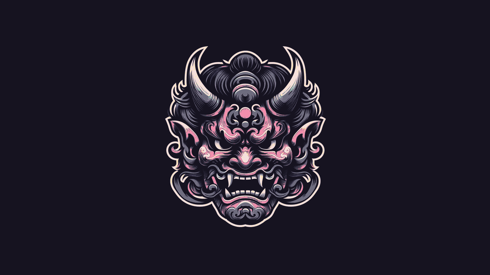

# Catppucci theme for Gnome

## GTK Theme
[Catppuccin GTK Theme](https://github.com/catppuccin/gtk) now archived.

## Terminal 
Zsh with [starship prompt](https://starship.rs).

## Browser
Firefox with [Bali10050 FirefoxCSS](https://github.com/Bali10050/FirefoxCSS)
Startpage [tilde](https://github.com/xvvvyz/tilde) modified to match colors.

## Extensions
- AppIndicator
- Clipboard indicator
- Dash to dock
- Just perfection
- Status area and horizontal spacing
- Tiling assistant
- User themes
- Vitals

## Wallpaper 
Made by Dall-E and edited with https://notneelpatel.tech/WallpaperThemeConverter to match catppuccin color.

